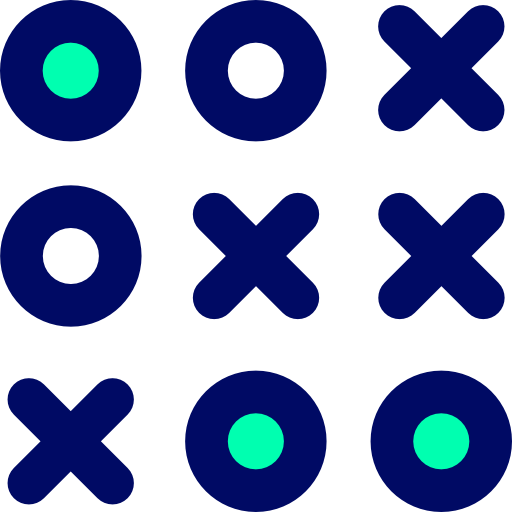
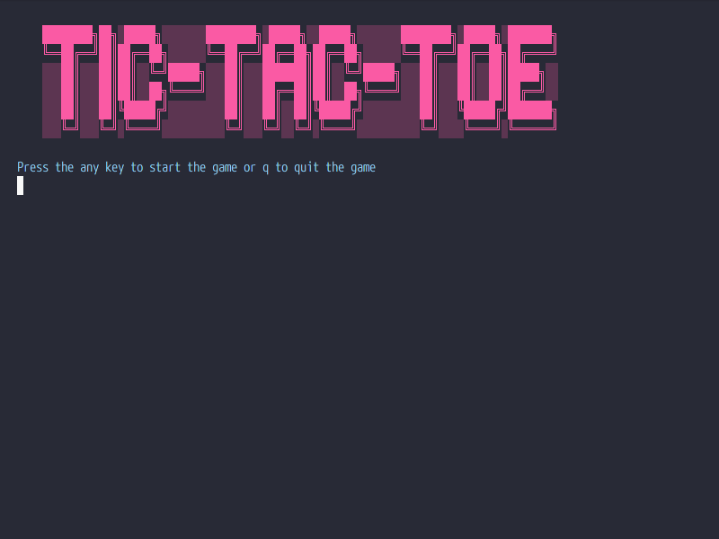

<h1 align="center">
  <br>
  <a href="https://github.com/Lameck1/Tic-Tac-Toe/archive/develop.zip"></a>
</h1>

<h1 align="center">Tit-Tac-Toe Game</h1>

<p align="center">
    <a href="https://github.com/Lameck1/Tic-Tac-Toe/issues">
    
     <a href="https://github.com/Lameck1/Tic-Tac-Toe/pulls">
    
     <a href="https://github.com/Lameck1/Tic-Tac-Toe/blob/main/LICENSE">
    
     <a href="https://https://github.com/Lameck1/Tic-Tac-Toe/graphs/contributors">
    
    
</p>
      
<p align="center">
  <a href="#about">About</a> •
  <a href="#prerequisites">Prerequisites</a> •
  <a href="#rules-for-tic-tac-toe">Rules</a> •
  <a href="#getting-started">Getting Started</a> •
  <a href="#gameplay-instructions">Gameplay Instructions</a> •
  <a href="#contributing">Contributing</a> •
  <a href="#authors">Authors</a> •
  <a href="#license">License</a>
</p>

---

## About
This project contains a Tic-Tac-Toe game. Tic-tac-toe, noughts and crosses, or Xs and Os, is a paper-and-pencil game for two players, X and O, who take turns marking the spaces in a 3×3 grid. The player who succeeds in placing three of their marks in a horizontal, vertical, or diagonal row is the winner. It is a solved game with a forced draw assuming best play from both players.




## Prerequisites

In order to play the game user should have ruby installed on the local machine


## RULES FOR TIC-TAC-TOE
1. The game is played on a grid that's 3 squares by 3 squares.
2. You are X, your friend is O. Players take turns putting their marks in the labelled cells.
3. The first player to get 3 of the marks in a row (up, down, across, or diagonally) is the winner.
4. When all 9 cells are full, the game is over. If no player has 3 marks in a row, the game ends in a tie.

## Getting Started

### Step 1

To get started you have to clone the repo on your local machine. To clone the repo run the following command in a terminal emulator:
   
```
git clone https://github.com/Lameck1/Tic-Tac-Toe
```
       
Alternatively, you can click on the Tic-Tac-Toe logo in the readme file and it will download the repo as a zip file

### Step 2

Now navigate to the bin directory using the following command

```
cd bin
```

### Step 3

Run the game by executing the main.rb file using the following command:

```
./main.rb
```

## Gameplay Instructions

- After running the game, press any key to continue or 'q' to quit the game
- Enter the name of two players
- You will be presented the 3x3 tic-tac-toe grid in which each cell will be labelled with a number
- You can enter the cell number to make a move in the corresponding cell

## Authors

👤 **Anas Siddiqui**

- GitHub: [Anas Siddiqui](https://github.com/smcommits)


👤 **Lameck Otieno**

- GitHub: [@githubhandle](https://github.com/Lameck1)
- Twitter: [@twitterhandle](https://twitter.com/lameck721)
- LinkedIn: [LinkedIn](https://www.linkedin.com/in/lameck-odhiambo-642b7077/)

## 🤝Contributing

Contributions, issues, and feature requests are welcome!

## Show your support

Give a ⭐️ if you like this project!

## Acknowledgments

### Colorize Gem
  To add colors in the user-interface, we have used the ruby gem called colorize.
  
### The Tic-Tac-Toe logo
   <div>Icons made by <a href="https://www.flaticon.com/authors/vitaly-gorbachev" title="Vitaly Gorbachev">Vitaly Gorbachev</a> from <a href="https://www.flaticon.com/" title="Flaticon">www.flaticon.com</a></div>
   
## License

This project is [MIT](./LICENSE) licensed.


